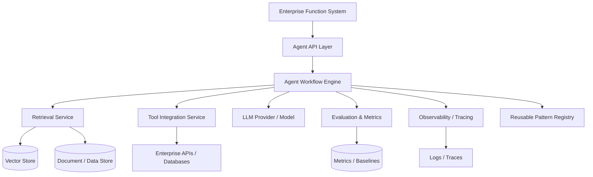

Enterprise Agentic Workflow Platform

## Problem Statement

A growing information and analytics platform needs to embed agentic AI capabilities into existing enterprise workflows without disrupting legacy systems, without creating isolated one-off solutions, and with enough reliability, observability, and reuse that business functions can own the outcomes after an innovation squad transitions out.

The core challenge: agentic systems (LLM-driven, tool-augmented, retrieval-based) behave differently from deterministic services. They require evaluation frameworks, graceful failure handling, and operational visibility — while still delivering real customer value on a time-boxed cycle.

## Discovery

### Context
Large multi-segment enterprises are moving AI from R&D to embedded product delivery. Innovation squads work inside business functions but must leave sustainable, reusable capabilities behind.

### Constraints
- Integration with existing enterprise APIs and data pipelines.
- Short delivery cycles (validated outcomes over perfect architecture).
- Reuse mandate: patterns must transfer across functions.
- Production-grade reliability required for agentic behavior.

### Unknowns (Not Pretended)
- Specific internal service architecture.
- Actual customer-facing product names.
- Baseline metrics for evaluation.
- Regulatory specifics (likely present in health/research domain).

## Options Considered

### Option 1 — Build One-Off Agent Integrations Per Function
Fastest initial delivery but creates isolated solutions, no reuse, high handover cost.

### Option 2 — Incremental Modernisation with Reusable Agent Framework
Build a generic agent framework (retrieval, tools, evaluation, observability) and adapt it per function with starter kits. Balances speed and reuse.

### Option 3 — Buy / Partner for Agent Orchestration Platform
Faster infrastructure but less control over reuse patterns, evaluation frameworks, and enterprise integration specifics.

## Decision

Select **Option 2 — Incremental Modernisation with Reusable Agent Framework**.

Rationale:
- Matches the role's explicit reuse/starter-kit mandate.
- Allows short-cycle delivery per function while building institutional capability.
- Keeps evaluation, observability, and guardrails as first-class components rather than afterthoughts.
- Supports gradual handover: starter kits and patterns make ownership transferable.

Rejected alternatives:
- Option 1 violates reuse and handover requirements.
- Option 3 introduces vendor dependency for a capability the organisation explicitly wants to own ("capabilities we need to deliver customer value and growth").

## Architecture

Components (each exists for a reason):
- **Agent API Layer**: stable interface between enterprise systems and agent behavior.
- **Agent Workflow Engine**: orchestrates multi-step agent tasks (not a generic workflow tool — purpose-built for agentic cycles).
- **Retrieval Service**: RAG pipeline; connects to vector and document stores.
- **Tool Integration Service**: connects agents to existing enterprise APIs; isolates external dependency risk.
- **LLM Provider / Model**: core reasoning; replaceable (vendor independence).
- **Evaluation & Metrics**: compares agent outcomes to baselines; prevents unmeasured production behavior.
- **Observability / Tracing**: traces agent steps, tool calls, retrieval results; needed for reliability.
- **Reusable Pattern Registry**: starter kits, reference implementations for reuse across functions.

## Trade-offs

| Improved | Complexity Introduced |
|---|---|
| Reuse across functions | Pattern registry requires governance |
| Production reliability (eval + observability) | Additional infrastructure cost |
| Vendor independence (swappable LLM) | Abstraction overhead |
| Gradual handover (starter kits) | Initial delivery slightly slower than one-off |

## Failure Modes

| Failure | Impact | Mitigation |
|---|---|---|
| LLM provider outage / degradation | Agent workflows fail | Fallback to degraded mode; circuit breaker; queued retry |
| Retrieval returns incorrect context | Agent produces poor or misleading output | Evaluation framework detects drift; human-in-the-loop for critical actions |
| Tool integration fails (enterprise API) | Partial workflow failure | Idempotent retries; graceful degradation; alert on failure |
| Evaluation misses quality degradation | Unreliable behavior reaches users | Continuous baseline comparison; alerting thresholds |
| Reuse patterns become outdated | Technical debt accumulates across functions | Pattern registry governance; versioned starter kits |

## Scale / Evolution

- **10× Scale**: Pattern registry becomes critical; evaluation infrastructure must support higher volume; retrieval and vector storage become bottlenecks first.
- **New Products**: Agent framework reused for new business functions with different starter kits; evaluation baselines must be defined per use case.
- **New Markets**: Integration patterns must become configurable for different enterprise APIs and compliance requirements.
- **Larger Organisation**: Ownership model evolves from squad-owned to function-owned; governance of pattern registry becomes formal.
- **Higher Reliability**: Additional controls: stricter evaluation thresholds, automated rollback for agent behavior changes, audit trails for agent decisions.

## Expected Outcomes (Not Achieved — Not Implemented)

- Reduced manual effort for business functions through agent-augmented workflows.
- Faster feature delivery for AI capabilities via reusable patterns.
- Improved reliability through evaluation, observability, and guardrails.
- Sustainable ownership after squad transition through starter kits and documentation.

### Metrics (Framework Only — No Invented Values)
- **Quality**: evaluation score against baseline per agent workflow.
- **Time-to-value**: time from requirement to production agent feature.
- **Operational cost**: inference + infrastructure + maintenance cost per workflow.
- **Reuse rate**: percentage of new agent features using registry patterns.

## Key Principles

- Problem-first, not tool-first.
- Reuse over one-off delivery.
- Production reliability requires evaluation and observability, not just code quality.
- Handovers are part of design, not afterthoughts.
- Agent behavior is non-deterministic — architecture must account for failure, drift, and degradation explicitly.
